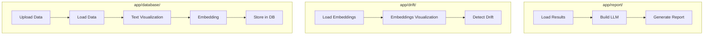

# datadrift_dataclinic

## 주소
- https://github.com/keti-datadrift/datadrift_dataclinic.git

## 개요
- 데이터 드리프트 관리 기술의 기반 프레임워크입니다.
- 개발 및 유지 관리 기관 : 한국전자기술연구원(KETI)
- 최종 검토 기관 : __한국전자기술연구원(KETI)__

### Full Flow
--------
 [](https://github.com/evidentlyai/evidently/tree/v0.5.1)




#### [1] How to Start DataDrift_Dataclinic 
- This project works properly only in environments where CUDA is available.

1. pull this repository
    ```
    git clone https://github.com/keti-datadrift/datadrift_dataclinic.git
    ```
2. change dir
    ```
    cd datadrift_dataclinic
    ```
3. make virtual environment
    ```
    brew install python@3.11
    python3.10 -m venv venv
    source venv/bin/activate

    pip install -r requirements.txt
    ```
4. intall faiss
    - (only Available GPU) `pip install faiss-gpu`

#### [2] Setup environments

1. build Milvus DB
    ```
    cd milvus_db                   # cd datadrift_dataclinic/db/milvus_db
    docker compose up -d
    ```

2. build Ollama
    
    2.1 [initial settings](docs/build_ollama.md)
    
    2.2 pull models
        
        ```
        cat ollama-models.txt | xargs -n 1 ollama pull
        ```
    
    2.3 (optional) To check the installed models:
        
        ```
        ollama list
        ```

#### [3] Usage Instructions
1. check pwd
    ```
    pwd                           # datadrift_dataclinic
    ```
2. Start Streamlit !
    ```
    streamlit run main.py
    ```
3. END streamlit 

    - (window) `ctrl` + `c`
    - (mac) `pkill -f streamlit`

### Stacks
          


## Acknowledgements (사사)
- 이 연구는 2024년도 정부(과학기술정보통신부)의 재원으로 정보통신기획평가원의 지원을 받아 수행된 연구임 (No. RS-2024-00337489, 분석 모델의 성능저하 극복을 위한 데이터 드리프트 관리 기술 개발)
- This work was supported by Institute of Information & communications Technology Planning & Evaluation (IITP) grant funded by the Korea government(MSIT) (No. RS-2024-00337489, Development of data drift management technology to overcome performance degradation of AI analysis models)
