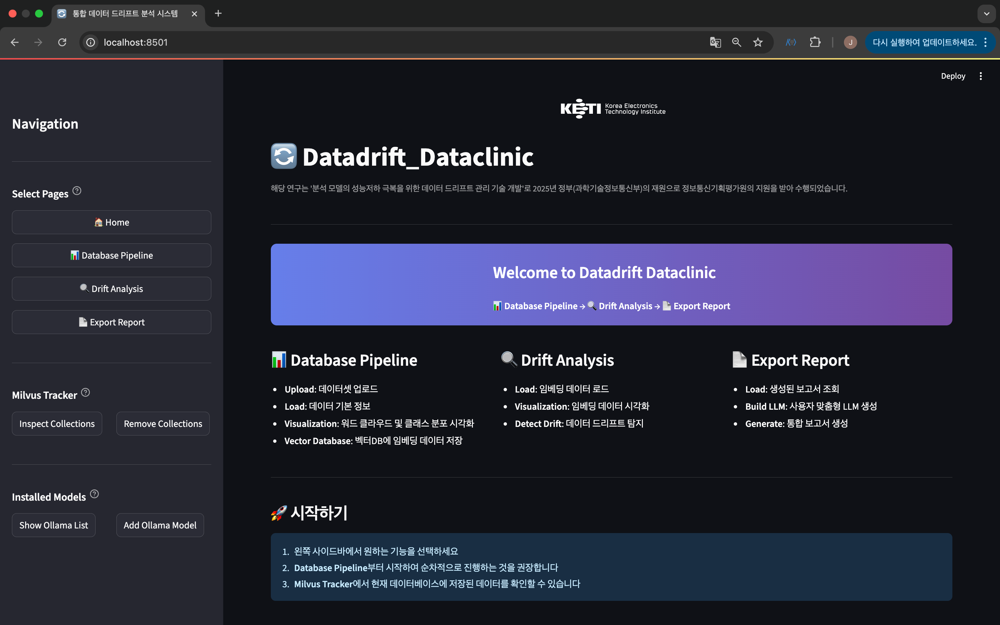

# datadrift_dataclinic

## 주소
- https://github.com/keti-datadrift/datadrift_dataclinic.git

## 개요
- 데이터 드리프트 관리 기술의 기반 프레임워크입니다.
- 개발 및 유지 관리 기관 : 한국전자기술연구원(KETI)
- 최종 검토 기관 : __한국전자기술연구원(KETI)__

## DataDrift Dataclinic

   [](https://github.com/evidentlyai/evidently/tree/v0.5.1)


An interactive Streamlit-based AI dashboard for detecting and analyzing data drift in text datasets. Supports both FAISS and Milvus vector stores, and can integrate with Ollama LLMs.



### App Overview
The app is organized into **three main pipelines**, as shown below:


### Installation

#### [1] How to Start DataDrift_Dataclinic 
This project works properly only in environments where CUDA is available.

1. pull this repository
    ```
    git clone https://github.com/keti-datadrift/datadrift_dataclinic.git
    ```
2. change dir
    ```
    cd datadrift_dataclinic
    ```
3. (Linux) make virtual environment
    ```
    # python version 3.10
    sudo apt install python3.10 python3.10-venv python3.10-dev
    sudo apt install python3.10-distutils
    curl https://bootstrap.pypa.io/get-pip.py | python3.10
    
    # mk virtual env
    python3.10 -m venv venv
    source venv/bin/activate

    # install libraries
    pip install -r requirements.txt
    ```

#### [2] Setup environments

1. [🔗 build Milvus DB](docs/build_milvusdb)
    ```
    cd db/milvus_db                   # cd datadrift_dataclinic/db/milvus_db
    docker compose up -d
    ```

2. build Ollama
    
    2.1 [🔗 initial setup](docs/build_ollama.md)
    
    2.2 check space

        bash models/check_space.sh

    2.3 pull models
        : choose [1] or [2]
        
        # [1] If you have limited storage space or want to reduce download time:
        
        cat models/setup_essential_models.txt | xargs -n 1 ollama pull
        
        # [2] If you have sufficient storage space:
        
        cat models/setup_all_models.txt | xargs -n 1 ollama pull
        

#### [3] Usage Instructions
1. check pwd
    ```
    pwd                           # datadrift_dataclinic
    ```
2. Start Streamlit !
    ```
    streamlit run main.py
    ```
3. END streamlit 

    - (window) `ctrl` + `c`
    - (mac) `pkill -f streamlit`

### Stacks
          

### Directory Structure
```
🔄 datadrift_dataclinic
├─ .gitignore
├─ README.md
├─ app
│  ├─ database/
│  ├─ drift/
│  └─ report/
├─ db
│  ├─ faiss_db/
│  ├─ milvus_db/
│  └─ pdf_db/
├─ docs
│  ├─ build_milvusdb.md
│  ├─ build_ollama.md
│  ├─ drift_data/
│  └─ img/
├─ main.py
├─ models
│  ├─ check_space.sh
│  ├─ setup_all_models.txt
│  └─ setup_essential_models.txt
├─ reports/
├─ requirements.txt
├─ static/
└─ utils.py
```
©generated by [Project Tree Generator](https://woochanleee.github.io/project-tree-generator)


## Acknowledgements (사사)
- 이 연구는 2024년도 정부(과학기술정보통신부)의 재원으로 정보통신기획평가원의 지원을 받아 수행된 연구임 (No. RS-2024-00337489, 분석 모델의 성능저하 극복을 위한 데이터 드리프트 관리 기술 개발)
- This work was supported by Institute of Information & communications Technology Planning & Evaluation (IITP) grant funded by the Korea government(MSIT) (No. RS-2024-00337489, Development of data drift management technology to overcome performance degradation of AI analysis models)
