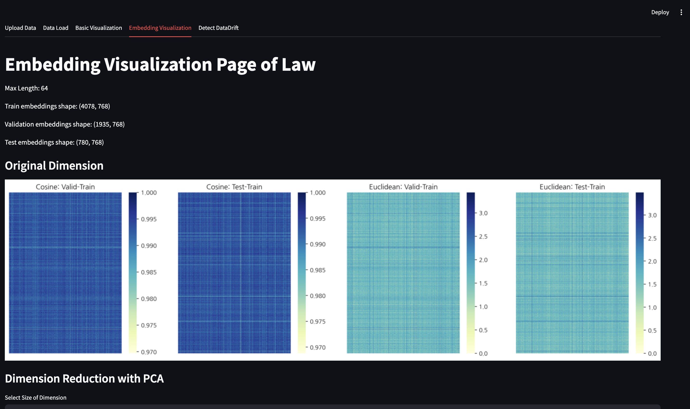
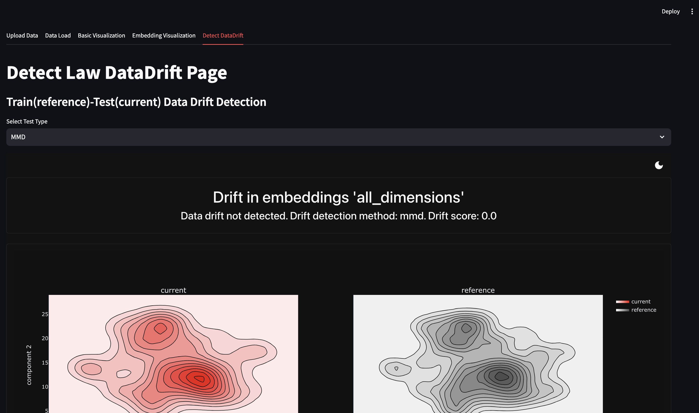

## Key Features

| [Data Load](pages/data_load.py) | [Base Visualization](pages/base_visualization.py) | [Embedding Visualization](pages/embedding_visualization.py) | [Detect DataDrift](pages/detect_datadrift.py) |
| ---------- | ---------- | ---------- | ---------- |
|     데이터 로드       |     베이스 시각화      |      임베딩 시각화      |    데이터 드리프트 탐지        |
|            |        |           |      |


## Documentation
데이터 드리프트 탐지와 관련해 아래 문서를 참고
- [Definition of Data Drift](docs/DataDrift.md)
- [Open-Sourece Tools for Detecting Data Drfit](docs/DriftDetection-Tools.md)
- [Test Type for Detecting Data Drift](docs/TestTypes.md)
- [Dimesionality Reduction for Effective Detecting Drift](docs/Dimensionality-Reduction.md)
- [Text DataDrift](docs/Text-DataDrift.md)

## Usage Instructions
1. streamlit 접속
    
    ```
    streamlit run main.py
    ```

2. [데이터셋 업로드](pages/upload_data.py)
3. 데이터 로드에서 결측치 유무 판별 
    - 결측치 없어야 진행 가능, 데이터의 크기가 너무 크면 진행 불가
4. 시각화, 임베딩, 데이터 드리프트 탐지 진행
5. 사이드 바를 통해 각 페이지 확인
6. streamlit 중단

    - (window) `ctrl` + `c`
    - (mac) `pkill -f streamlit`

## Install Prerequisite
- fonts : [나눔고딕 레귤러](https://fonts.google.com/selection)
- library : [requirements](requirements.txt)
- open source : [EvidentlyAI](https://github.com/evidentlyai/evidently/tree/main/examples/integrations/streamlit_dashboard)
- stemming for wordcloud : [Pecab](https://github.com/hyunwoongko/pecab)
- datasets : 법률 관련 문서 데이터셋 (한림대학교 연구팀 구축)

## Directory Structure

```
streamlit_dashboard/
├── pages/
│   ├── base_visualization.py       # 기본적인 시각화 기능
│   ├── data_load.py                # 데이터 로드 관련 기능
│   ├── detect_datadrift.py         # 데이터 드리프트 감지
│   ├── detect_propertydrift.py     # 속성(Property) 단위 드리프트 감지
│   ├── embedding_visualization.py  # 벡터 임베딩 시각화
│   ├── upload_data.py              # 데이터 업로드 기능
├── img_files/
├── reports/                        # 분석 및 로그 리포트
├── fonts/
├── docs/
├── main.py                         # Streamlit 실행 메인 파일
├── utils.py                         # 공통 유틸 함수
├── vector_database.py               # 벡터 데이터베이스 관리
├── requirements.txt                 
├── README.md                       
```


## Stacks

   