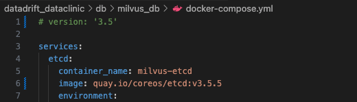

### Install Milvus Vector Database
---
#### Initial Setup
    cd db/milvus_db                             # cd datadrift_dataclinic/db/milvus_db
    docker compose up -d


#### If the initial setup fails, 

1. Remove existing files
    ```
    rm -rf db/milvus_db/docker-compose.yml
    rm -rf db/milvus_db/volumes
    ```

2. Download the docker-compose.yml file
    ```
    wget https://github.com/milvus-io/milvus/releases/download/v2.3.1/milvus-standalone-docker-compose.yml -O docker-compose.yml
    ```
    - [Additional Troubleshooting] If errors still occur, comment out the version line in the docker-compose.yml file.
        
        