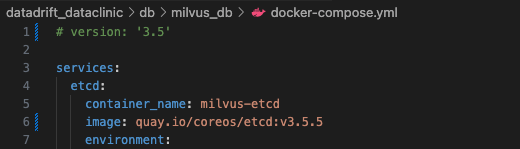

### ▪️ Install Vector Database for Text Data
---

#### Check Docker & Docker Compose

1. Check Docker version

   ```bash
   docker --version
   ```

2. Check Docker Compose version

   ```bash
   docker compose version
   ```

3. Verify permissions

   ```bash
   docker ps
   ```

   * If you see a `permission denied` error, it means your current user is not added to the `docker` group. Run the following commands:
        ```bash
        sudo usermod -aG docker $USER
        newgrp docker
        ```

### ▪️ Install Milvus

---
#### Initial Settings
1. Check directory
    ```
    cd db/milvus_db                      # cd datadrift_dataclinic/db/milvus_db
    ```

2. Remove existing files
    ```
    rm -rf docker-compose.yml
    sudo rm -rf volumes
    ```
    - milvus_db/docker-compose.yml 실제로도 사라졌는지, 경로에서 확인. 아직 존재한다면 해당 파일 영구적으로 삭제 진행
3. Remove containers
    ```
    docker compose down -v

    docker rm -f $(docker ps -aq --filter "name=milvus")
    ```
    - discard 'volumes' dir
        ```
        sudo rm -rf volumes
        mkdir -p volumes
        chmod 755 volumes
        ```
4. Download the docker-compose.yml file
    ```
    wget https://github.com/milvus-io/milvus/releases/download/v2.3.1/milvus-standalone-docker-compose.yml -O docker-compose.yml
    ```
    - [Additional Troubleshooting] If errors still occur, comment out the version line in the docker-compose.yml file.
        
        

#### Start Milvus
1. Excute Milvus
    ```
    docker compose up -d
    ```
    - if it doesn't work,
        ```
        docker-compose up -d
        ```

2. Check containers
    ```
    docker ps
    ```
    - Verify that **standalone**, **minio**, and **etcd** are all properly installed and running
    
3. start docekr
    ```
    # Docker 데몬 시작 
    sudo systemctl start docker

    # Docker 데몬 상태 확인
    sudo systemctl status docker
    ```