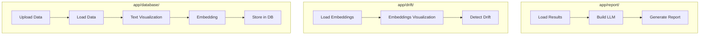

## App Overview

### Full Flow 
The app is organized into **three main pipelines**, as shown below:

### Step-by-Step Usage

| Pipeline | Purpose | Output Location |
|----------|---------|----------------|
| **database** | Data upload & embedding generation | `db/milvus_db/` or `db/faiss_db/` |
| **drift** | Drift detection & visualization | In-app visualization |
| **report** | AI report generation | `reports/final/` |

__🎯 Complete workflow__ : `database` → `drift` → `report` → __Check [`final report`](../reports/final/)__

##### 🔹 `database`  
- Upload raw text data  
- Visualize text  
- Generate embeddings  
- Store embeddings to DB (Milvus)

##### 🔹 `drift`
- Load stored embeddings  
- Visualize embedding space  
- Run drift detection (Evidently, Distance metrics)

##### 🔹 `report`  
- Load drift results  
- Run report generation (FAISS)
- Integrate with LLMs for explanation generation

### Pipelines in Action

|  | database | drift | report |
| --- | --- | --- | --- |
| video |  [📽️ link](https://drive.google.com/file/d/1kI8gr2l7bfTphnWSlsVGZ_0TTRbbYXy1/view?usp=drive_link) | [📽️ link](https://drive.google.com/file/d/1hz6OROAqq7Zg_QCnvw0rQQ1yOgkQnwF8/view?usp=drive_link) | [📽️ link](https://drive.google.com/file/d/1FSSwlzElAy_bbFaLEJ8wxVWnQbmC8yKX/view?usp=drive_link) |
| code |  [🔗 link](../app/database/) | [🔗 link](../app/drift/) | [🔗 link](../app/report/) |