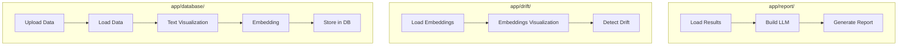

## App Overview

### Full Flow 
The app is organized into **three main pipelines**, as shown below:

##### 🔹 `app/database/`  
- Upload raw text data  
- Visualize text  
- Generate embeddings  
- Store embeddings to DB (Milvus / FAISS)

##### 🔹 `app/drift/`  
- Load stored embeddings  
- Visualize embedding space  
- Run drift detection (Evidently, Distance metrics)

##### 🔹 `app/report/`  
- Load drift results  
- Run report generation  
- Integrate with LLMs for explanation generation