# README

> **📌 Initial settings**
>    - 운영 환경에서 data drift 탐지를 목적으로 하기에 차원축소 전에 학습은 trainset으로만 적용    
> ----
>**data**
>  - train : law domain train data
>  - valid : law domain valid data
>  - test : LBOX casename test data       
>
> **purpose**
>  - 전체 데이터의 변화를 모니터링하는 것은 비효율적
>  - 드리프트가 특정 차원에 국한될 경우 불필요한 차원이 오히려 탐지 방해

---

## 1. [DataDrift without Dimension Reduction](datadrift_without-dr.ipynb)

---

> 차원 축소 없이 데이트 드리프트 탐지 진행

|  | Opensource | feature | `valid` vs `train` | `test` vs **`train`** |
| --- | --- | --- | --- | --- |
| **Maximum Mean Discrepancy** | EvidentlyAI | 전체 데이터 분포를 직접 비교하는 고차원 분포 간 유사성 측정 | 0.0001 | 0.2087 |
| **Wasserstein Distance** | EvidentlyAI | 분포 간의 이동 거리 계산, 분포 형태보다는 거리 비용에 초점 | 0.0247 | 0.9635 |
| **Energy Distacne** | EvidentlyAI | 거리 기반 접근으로 중심 및 분산 차이를 동시에 고려 | 0.0 | 0.474 |

* drift score : 선택된 메트릭을 통해 Reference Data와 Current Data의 분포 차이를 수치화한 값

* [EvidentlyAI](https://docs.evidentlyai.com/) 는 Report를 제공하고 있어 시각화 결과를 도출 가능

## 2. [Methods for Dimension Reduction](dimension-reduction_base.ipynb)

---

> **dimension reduction order**
> 
> 1. train에 대해서만 먼저 적합 진행
>     
>     train 기준으로 차원 축소를 진행한 뒤, 다른 데이터로 같은 공간에 투영해 변화 감지
>     
>     → 실제 시스템에서 배포된 모델이 학습한 데이터와 새로 들어온 데이터 간의 변화를 감지하는 데 효과적
>     
> 2. 병합한 뒤 pca 적용
> 3. 각각 pca 적용

### 2.1 Select Dim

|  | PCA | KernelPCA | Truncated SVD | GRP | Autoencoder |
| --------- | --------- | -------- | --------- | --------- | --------- |
| **Plot**    |  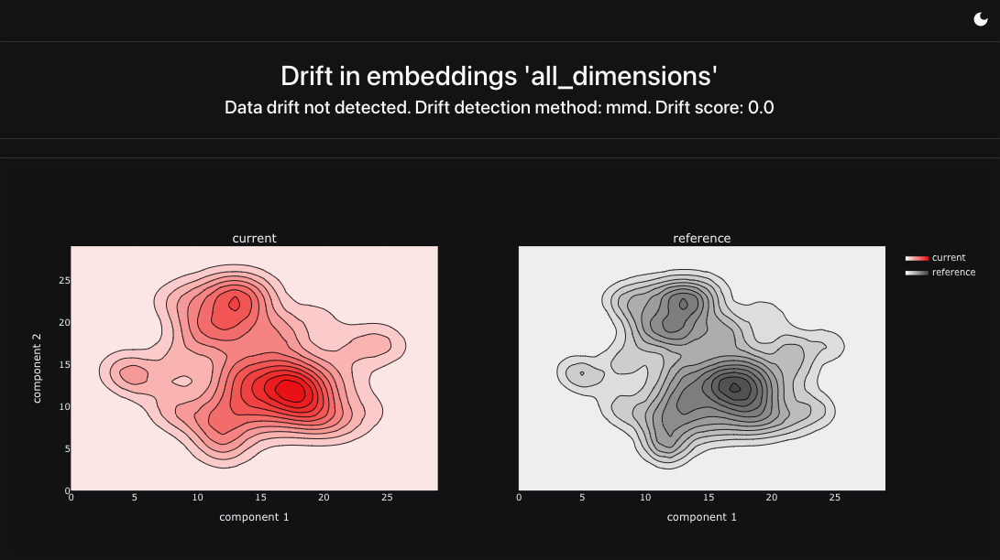 | 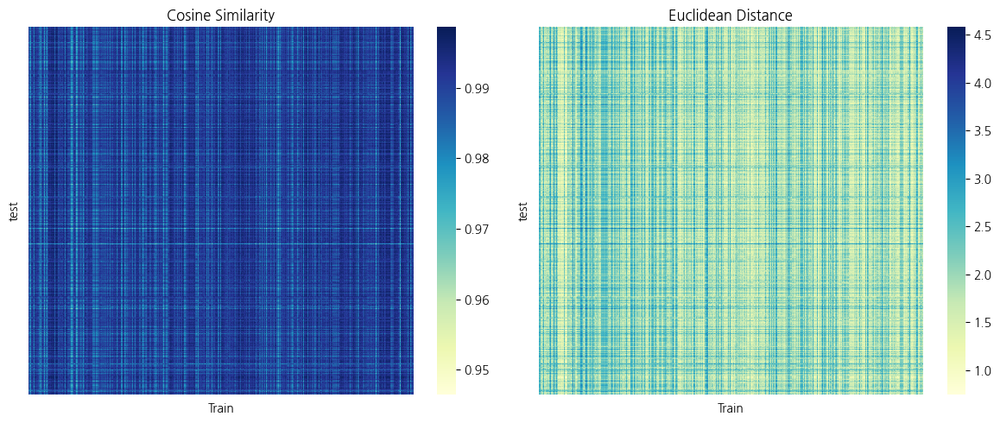 | 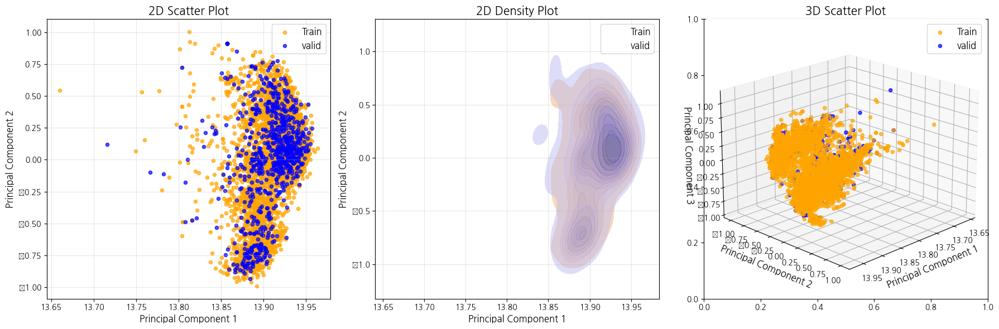 | 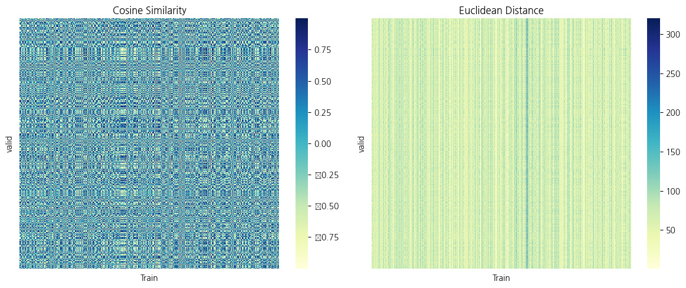   |  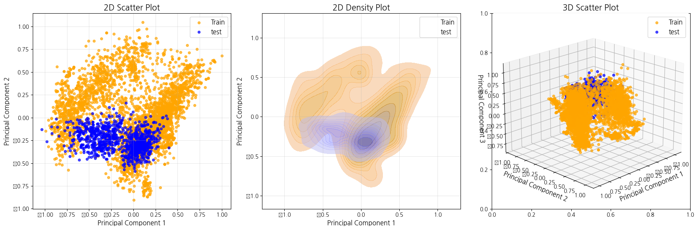|
| **Stress**                   | 93                      |      91                   |          77          |       88          | 71 |
| **Explained Variance Ratio** | 188                     |      -                     |           188          |           -      | - |
| **Reconstruction Error**     | 115                     |     101                   |           104        |         -        | 328  |
| **size of dim**              | 188                     |      101                     |         188          |       88          |    328                         |

적절한 차원 선택을 위해 데이터의 구조적 변화를 감지하기 위해 평가방법에 따라 다른 메트릭을 선택

 

### 2.2 Visualization of Dimension Reduction Results

데이터 드리프트 탐지 목적이기에, 차원 축소를 **train-valid**와 **train-test**에서 각각 따로 진행

#### 2.2.1 Distance

|  | dim | `valid` vs `train` | `test` vs **`train`** |
| --- | --- | --- | --- |
| PCA | 188 |  |  |
| Kernel PCA | 88 | 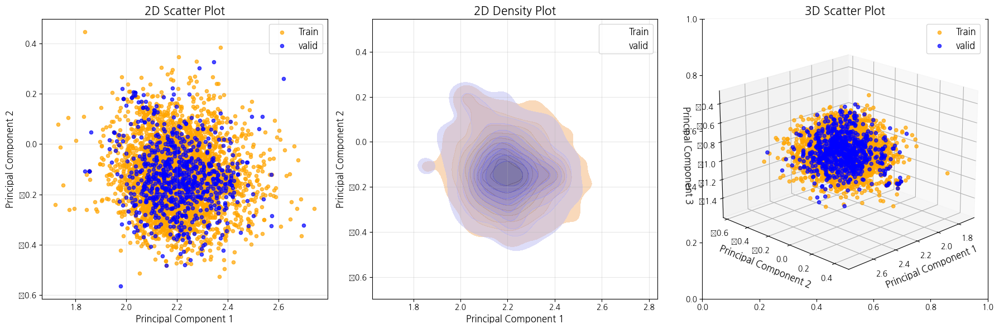 | 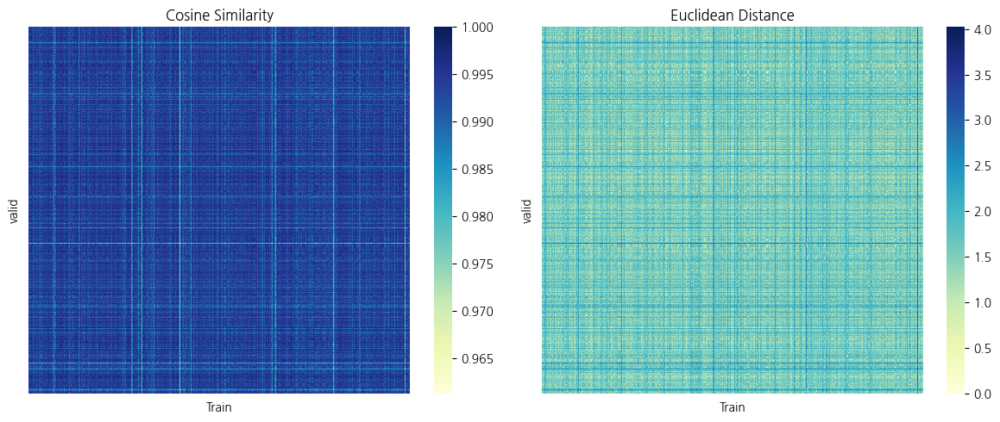 |
| Truncated SVD | 188 | 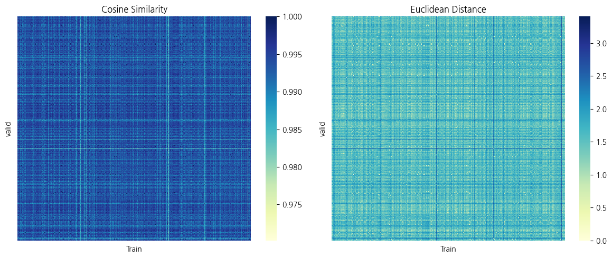| 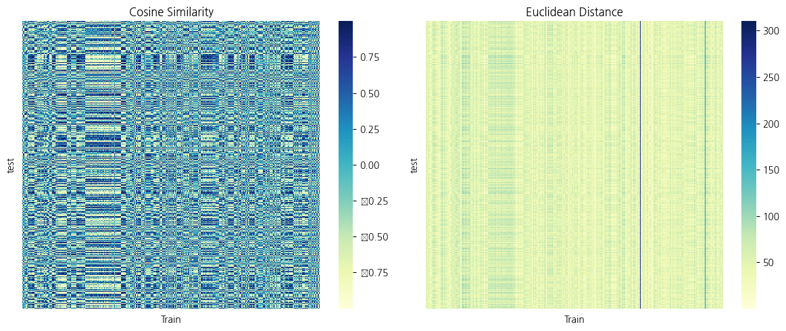 |
| GRP | 88 |  | 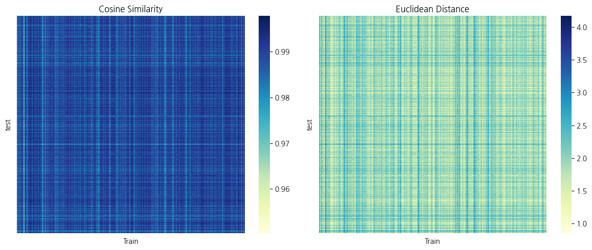 |
| AutoEncoder | 328 | 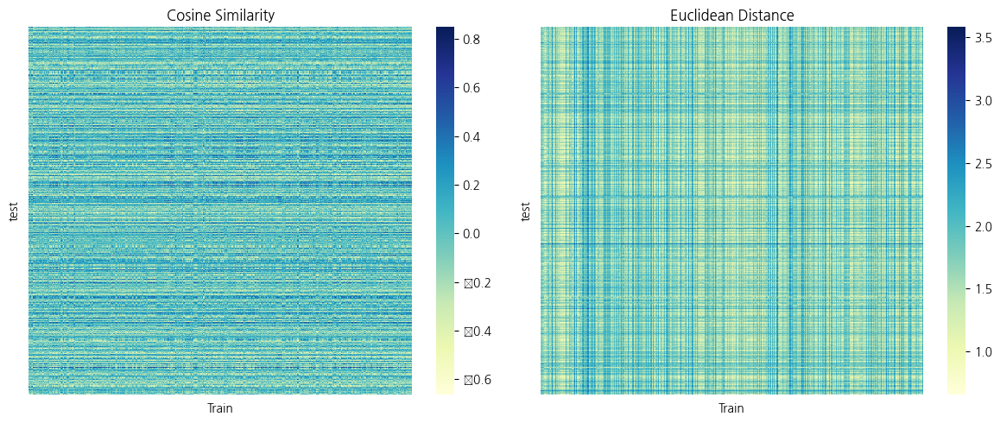 | 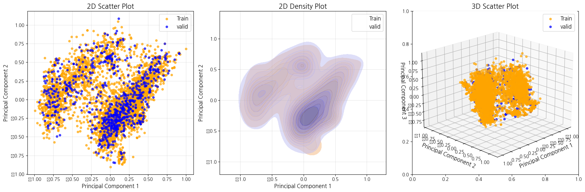 |

#### 2.2.2 Plot

|  | dim | `valid` vs `train` | `test` vs **`train`** |
| --- | --- | --- | --- |
| PCA | 188 |  |  |
| Kernel PCA | 77 |  | 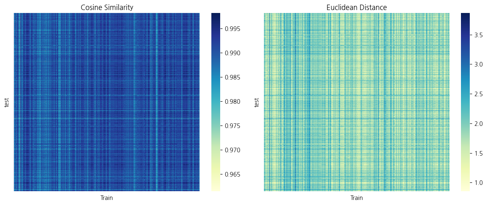 |
| Truncated SVD | 188 | 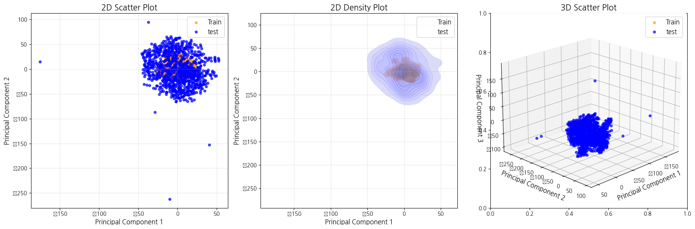 | 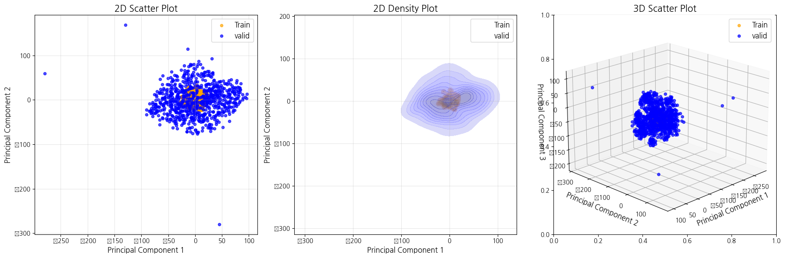 |
| GRP | 88 | 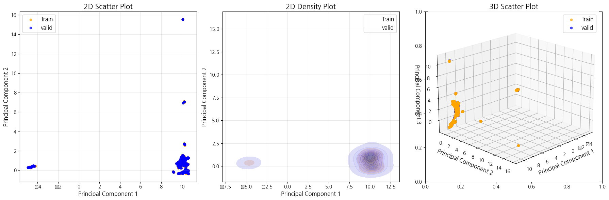 | 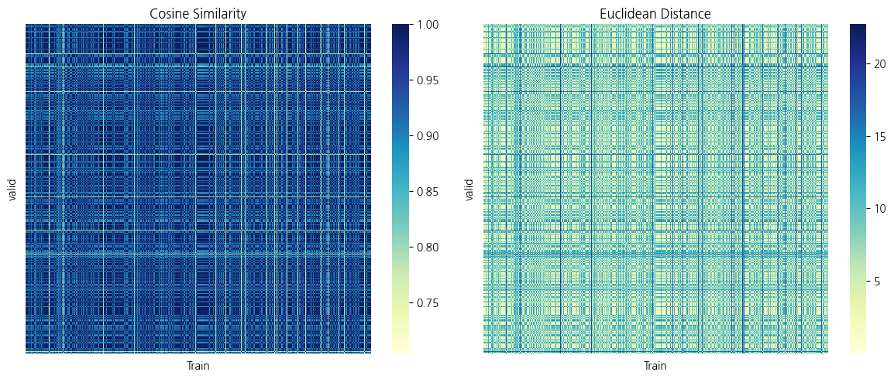 |
| AutoEncoder | 328 | 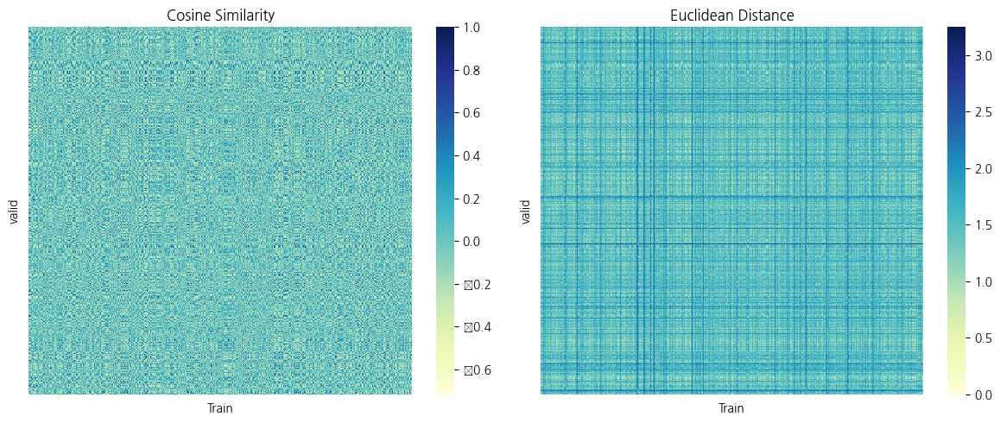 |  |

 

## 3. [DataDrift with Dimension Reduction](datadrift_with-dr.ipynb)

|  |  | **PCA** | **Kernel PCA** | **SVD** | **GRP** | Autoencoder | **Base** |
| --- | --- | --- | --- | --- | --- | --- | --- |
| dim |  | 188 | 101 | 188 | 88 | 328 | 768 |
| **MMD** | `valid` vs `train` | 0.0001 | 0.0001 | 0.0001 | 0.0002 | 0.0002 | 0.0001 |
| **MMD** | `test` vs `train` | 0.2213 | 0.241 | 0.2217 | 0.1965 | 0.1473 | 0.2087 |
| **WD** | `valid` vs `train` | 0.0247 | 0.0099 | 0.016 | 0.0227 | 0.003 | 0.0247 |
| **WD** | `test` vs `train` | 0.9635 | 1.0 | 1.0 | 0.9545 | 0.4055 | 0.9635 |
| **Energy Distance** | `valid` vs `train` | 0.0 | 0.0 | 0.0 | 0.0 | 0.0 | 0.0 |
| **Energy Distance** | `test` vs `train` | 0.474 | 0.5327 | 0.3936 | 0.7614 | 0.1433 | 0.474 |
---

- 차원축소를 적용한 경우, 대부분의 메트릭에서 Valid와 Test 간의 드리프트 점수가 Base보다 높거나 명확하게 나타남
- 이는 고차원 데이터의 노이즈가 줄어들고, 데이터의 주요 특징만 남게 되어 드리프트 감지가 더 효과적으로 이루어진 것으로 해석
