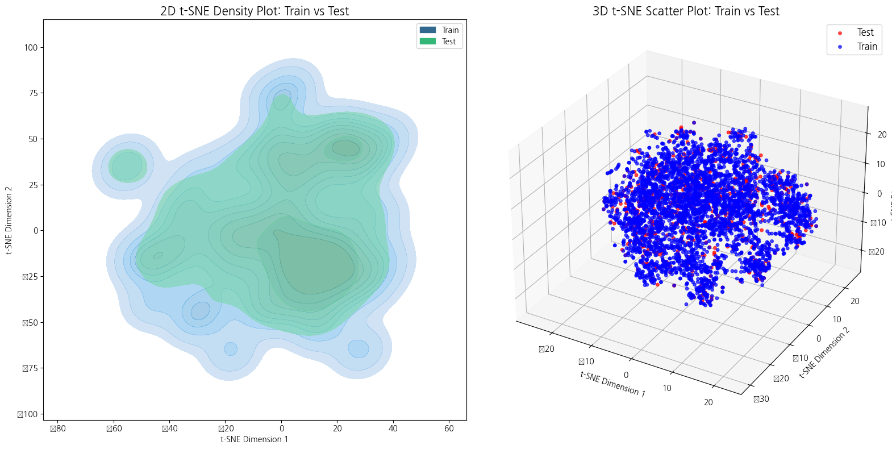
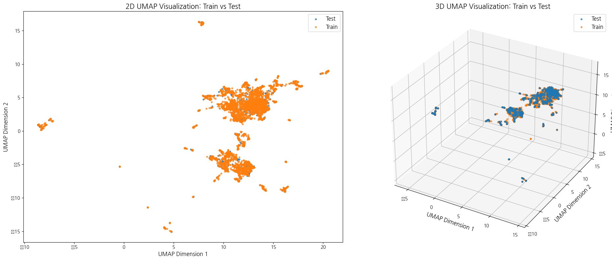
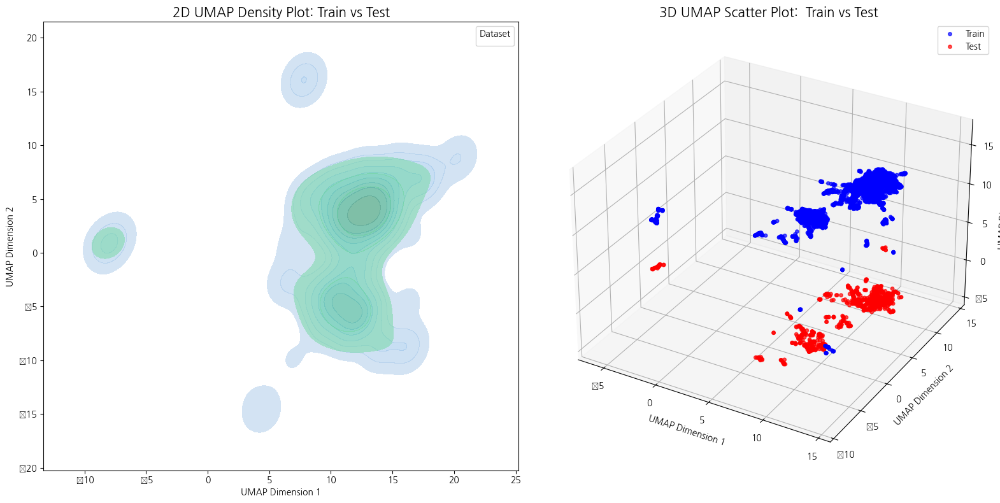
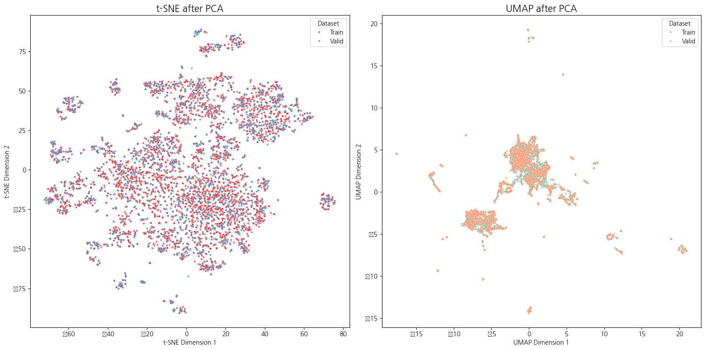
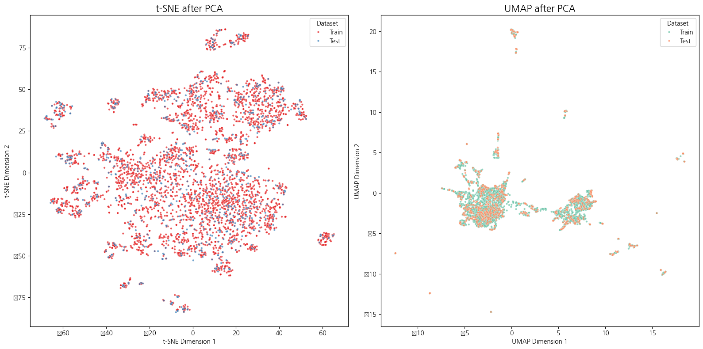

# [**How to detect data drift in text data?**](ver2_report_fin.ipynb)

---

## 1. Load Data

### 1.1. display

각 데이터의 상위 5개의 row를 나타낸 결과는 아래와 같음

`train`

| class | text                                                                                                   |
|-------|-------------------------------------------------------------------------------------------------------|
| i     | 2) 또한 자동차 열쇠에 대한 배타적인 점유를 취득하는 이상 인근에 주차된 해당 자동차를 ...            |
| w     | 자기의 행위로 인하여 타인의 사망이라는 결과를 발생시킬 만한 가능성 또는 위험이 있...                |
| u     | 이 사건의 경우 앞서 든 증거들에 의하여 인정되는 다음과 같은 사정들을 고려하여보면                   |
| c     | 나. 피고인은 본건 범행 당시 술에 취하여 심신상실 또는 심신미약의 상태에 있었다.                      |
| d     | ② 피해자가 피고인에게 먼저 시비를 걸며 부엌에 있던 식칼을 꺼내들고 피고인을 위협...                |

`valid`

| class | text                                                                                          |
|-------|----------------------------------------------------------------------------------------------|
| i     | 피해자가 입은 상해의 부위 및 정도는 사망에 이를 수 있는 정도의 위험한 수준이었고,             |
| c     | 이 사건 범행 당시 피고인에게 미필적으로나마 살인의 범의가 있었음을 충분히 인정할 ...         |
| e     | 이러한 손상은 둔기에 의해 발생 가능한 손상으로 보인다는 소견을 밝히고 있는 점,              |
| c     | 피고인 A에게 살인의 고의는 없었고,                                                           |
| c     | 피고인이 이 사건 범행 당시 음주로 인하여 사물을 변별할 능력이나 의사를 결정할 능...        |

`test`

| class | text                                                                  |
|-------|-----------------------------------------------------------------------|
| u     | 이 법원이 적법하게 채택하여 조사한 증거에 의하여 인정되는 아래와 같은 사정 즉, |
| u     | 위와 같은 사정들을 모아보면,                                          |
| u     | 앞서 살핀 증거에 의하여 인정되는 다음과 같은 사실 또는 사정을 종합하면, |
| u     | 피고인과 변호인은,                                                   |
| d     | (증거기록 제178쪽).                                                  |

### 1.2. data structure

각 분리된 데이터 셋의 길이, 컬럼 정보 그리고 해당 데이터 셋의 결측 개수를 나타냄

#### information of columns

| Column Name |	Data  Type | 
| --- | --- | 
| class | 	object	|
| facts | 	Text	|

#### information of data

| | **`train`** | **`valid`** | **`test`** |
| --- | --- | --- | --- |
| len | 4078 | 1935 | 780 |
| count(missing_values) | 0 | 0 | 0 |

`train`

| Class | Text       |
|-------|------------|
| Count | 4078       |
| Unique| 8          |
| Top   | d          |
| Text  | 살피건대,   |
| Freq  | 1360       |
| Text Frequency | 11 |

`valid`

| Class         | Text                         |
|---------------|------------------------------|
| Count         | 1935                         |
| Unique        | 8                            |
| Top           | d                            |
| Text          | 위 주장은 받아들이지 아니한다. |
| Frequency     | 687                          |
| Text Frequency| 6                            |

`test`

| Class         | Text                                               |
|---------------|----------------------------------------------------|
| Count         | 780                                                |
| Unique        | 8                                                  |
| Top           | d                                                  |
| Text          | (대법원 2009. 2. 26. 선고 2008도9867 판결 등 참조). |
| Frequency     | 274                                                |
| Text Frequency| 4                                                  |

## 2. Base EDA

Exploratory Data Analysis는 텍스트 컬럼과 텍스트가 아닌 컬럼으로 나눠서 진행함

### 2.1 nontext column

각 클래스별 분포를 파악하였으며 대체로 불균형임을 알 수 있음

### 2.2 text column

#### max_len 

텍스트 길이 분포 시각화한 것으로 띄어쓰기 기준으로 토큰화하였으며 가장 긴/짧은 문장의 길이를 추출함

| | **`train`** | **`valid`** | **`test`** |
| --- | --- | --- | --- |
| max(text_len) | 70 | 64 | 95 |
| min(text_len) | 1 | 1 | 1 |

#### wordcloud

Okt 형태소 분석기를 사용하며 명사만 추출해 적용

## 3. Embedding

임베딩을 위해 [한국어버전 RoBERTa](https://github.com/KLUE-benchmark/KLUE)를 사용하여 적용
- 사전학습 모델을 적용한 이유
    - 신조어나 드문 단어도 잘 표현 가능
    - 단어의 문맥에 따라 더 정확한 표현 생성
    - 다국어 및 비정형 텍스트 처리에 더 적합

 

아래와 같이 train을 적용한 결과 앞선 시각화보다 더욱 정교하게 토큰화된 것을 알 수 있음 

> ➡️ train 기준 max_len=64이며 이를 활용해 임베딩 적용

### 3.1 Distance visualization

train을 기준으로 valid, test와의 코사인 거리와 유클리디안 거리를 각각 비교함

두 메트릭이 데이터 간 분포 차이를 측정하는 데 유용한 정보를 제공

- 코사인 유사도는 패턴 변화(상대적 관계)에 민감하지만, 크기 변화에는 덜 민감
- 유클리디안 거리는 값의 크기 변화(절대적 차이)에 민감하지만, 방향성 변화에는 덜 민감

|         | `train`-`valid`           |  `train`-`test`           |
|------------------|--------------------|--------------------|
| **t-SNE**           |  |  |

> ➡️ 방향적으로 유사한 형태임을 알 수 있음

### 3.2 Dimension Reduction visualization

#### Base 

아래 표는 비선형적인 방법인 **t-SNE**와 **UMAP**을 사용 

- UMAP은 데이터 간의 전반적인 군집을 확인할 수 있고 t-SNE는 데이터 간의 세부적인 군집을 파악하는 데에 사용

- 고차원의 복잡한 데이터를 처리하는 데 효과적으로 데이터 변화의 차이를 시각적으로 비교하는 데에 유용함

|         | `train`-`valid`           |  `train`-`test`           |
|------------------|--------------------|--------------------|
| **t-SNE**           |  |  |
| **t-SNE**  density  |  |  |
| **UMAP**           |  |  |
| **UMAP**  density  |  |  |

#### Apply PCA

**PCA** 를 통해 50차원으로 차원을 축소한 후 시각화를 위해 2 또는 3개의 주성분만 사용해 시각화를 해 데이터의 더 많은 분산을 보존

|         | `train`-`valid`           |  `train`-`test`           |
|------------------|--------------------|--------------------|
| scatter plot |  |  |

PCA로 인해 50차원으로 축소된 상태에서 **t-SNE** 와 **UMAP** 를 시각화한 결과로 scatter plot을 활용한 것과 density를 활용한 것으로 나눠 진행함

|         | `train`-`valid`           |  `train`-`test`           |
|------------------|--------------------|--------------------|
| base |  |  |
| density  |  |  |

## 4. Detect Data Drift
기존 오픈소스인 [EvidentlyAI](https://docs.evidentlyai.com/) 와 [Alibi-detect](https://docs.seldon.io/projects/alibi-detect/en/latest/index.html)를 활용해 드리프트 탐지를 진행함

### 4.1 EvidentlyAI

 describe 

> 📍 **Maximum Mean Discrepancy**
>   두 확률 분포 간의 차이를 측정하기 위한 통계적 방법

 

> 📍 **Wasserstein Distance**
>   두 확률 분포 P와 Q 간의 거리를 측정해, 분포 P에서 Q로 변환할 때 얼마나 많은 질량을 얼마의 거리만큼 옮겨야 하는 지에 대한 수치

|         | `train`           |  `test`           |  drift score           | drift y/n |
|------------------|--------------------|--------------------|--------------------|--------------------|
| **mmd** |  |  | 0.0 | n |
| **wasserstein**  |  |  | 0.05 | n |

### 4.2 Alibi-detect 

 describe 

> 📍 **LSDD Drift**
>   Least-Squares Density Difference 두 분포 간의 밀도 차이를 직접 최소 제곱법으로 추정하는 방법

 

> 📍 **MMD Drift**
>   두 분포의 평균 차이를 최대화하는 방식으로 분포 간의 차이를 측정

 

> 📍 **Kolmogorov-Smirnov test**
>   두 데이터 분포의 누적분포함수 CDF 차이를 계산해 가장 큰 차이를 통한 비모수적 검정으로 특정 차원별 분포 비교

|         | h0 : `valid`           |  h1 : `test`           |  drift y/n |
|------------------|--------------------|--------------------|--------------------|
| **LSDD** | 0.676 | 0.192 | n |
| **MMD**  | 0.966  | 0.068 | n |
| **KS Test**  | - | - | n |

