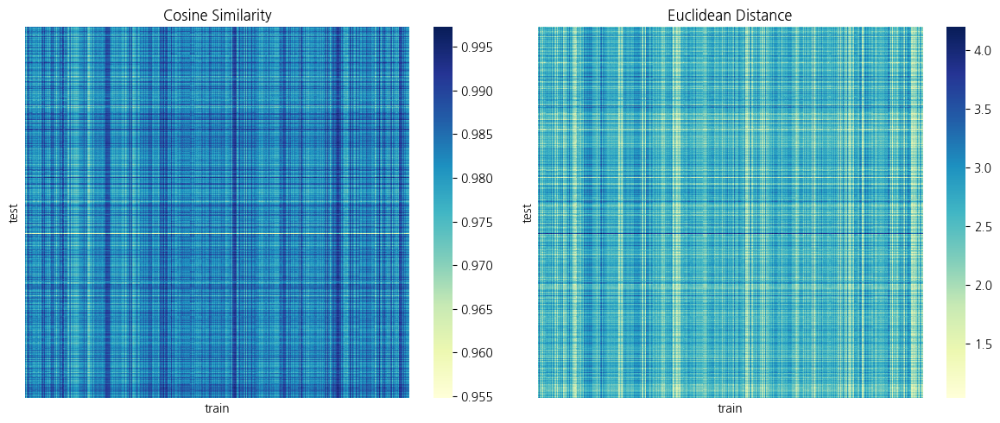
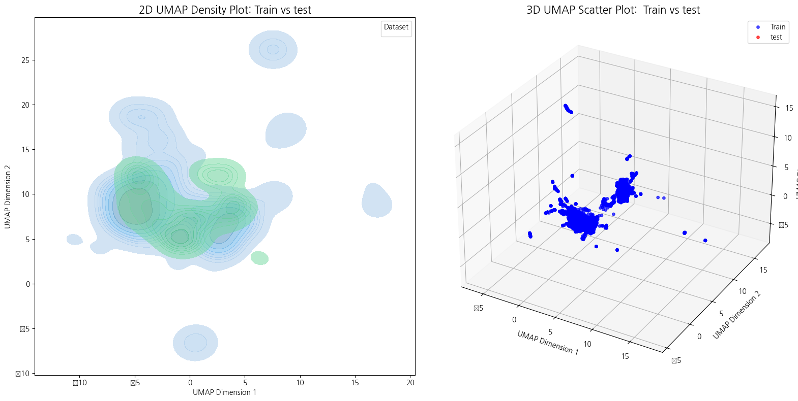
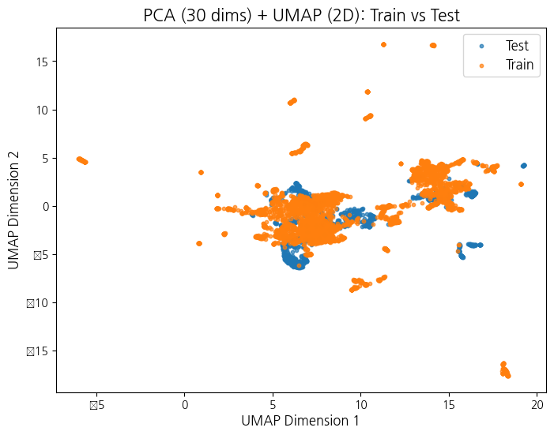
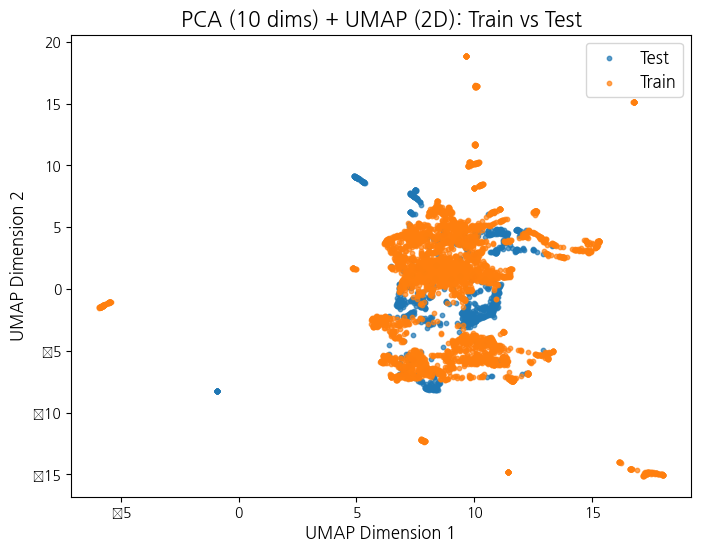

# Dimension Reduction

## Distance

|         | `train`-`valid`           |  `train`-`test`           |
|------------------|--------------------|--------------------|
| **base**        |  |  |
| **pca** `dim = 50`        |  |  |

## plot
|         |         | `train`-`valid`           |  `train`-`test`           |pca | 
|------------------|------------------|--------------------|--------------------|--------------------|
| **t-SNE**|    scatter       |  |  | x |
| **t-SNE**|    scatter       |  |  | o |
| **t-SNE** | density  |  |  | x |
| **t-SNE** | density  |  |  | o |
| **UMAP**  |    scatter     |  |  | x |
| **UMAP**  |    scatter     |  |  | o |
| **UMAP** | density  |  |  | x |
| **UMAP** | density  |  |  | o |

## 🥼 pca several times
p = Cumulative explained variance
|         |         | `train`-`valid`           |  `train`-`test`           |pca | 
|------------------|------------------|--------------------|--------------------|--------------------|
| **UMAP**|    scatter   2D    |  |  | 50 |
| **UMAP**|    scatter    2D     |  |  | 30 |
| **UMAP**|    scatter     2D    |  |  | 10 |
| **UMAP**|    scatter      2D   |  |  | 5 |
