## Full Flow

<aside>

**📌difficulty of detecting high dimensional data drift**

1. 고차원 데이터에서 특정 차원 or 특정 집합에서만 변화가 발생할 수 있음
    
    - 전체 데이터의 변화를 모니터링하는 것은 비효율적
    - 드리프트가 특정 차원에 국한될 경우 불필요한 차원이 오히려 탐지 방해
2. 저차원 공간에서 데이터 분포의 변화는 더 명확하게 나타나 drift detection 민감도 증가
    
</aside>
---------------

1. datadirft 기존 고차원에서 탐지
2. Dimension Reduction 실험 진행
3. 실험 유의미한지 탐색

    - visualization : distance, 2d scatter, 2d dense, 3d scatter
    - KS test

4. 최종 선택된 method로 datadrift 적용

## Experiment Settings
> * 분포 비교를 더 명확히 하고 싶기 때문에 각 데이터셋을 **병합**한 뒤 차원 축소를 적용해 시각화
> * 운영 환경에서 data drift 탐지를 목적으로 하기에 차원축소 전에 학습은 trainset으로만 적용 
> 

### Methods of Dimension Reduction
1. PCA
2. UMAP
3. t-SNE
4. SVD
5. Kernel PCA
6. GRP Gaussian Random Projection
7. Autoencoders 
8. Ensemble
    - PCA + UMAP 
    - PCA + t-SNE

### New Methods of Dimension Reduction from papers
- [PCA with Hellinger distance](https://link.springer.com/article/10.1007/s10115-020-01438-3)
- [SVD, Kernel PCA, GRP, Autoencoders](https://aclanthology.org/2024.lrec-main.579.pdf)

### Select dim 
#### 1. PCA 
Explained Variance Ratio 분산 변동 비율을 기준으로 적합한 `n_components` 값 확인
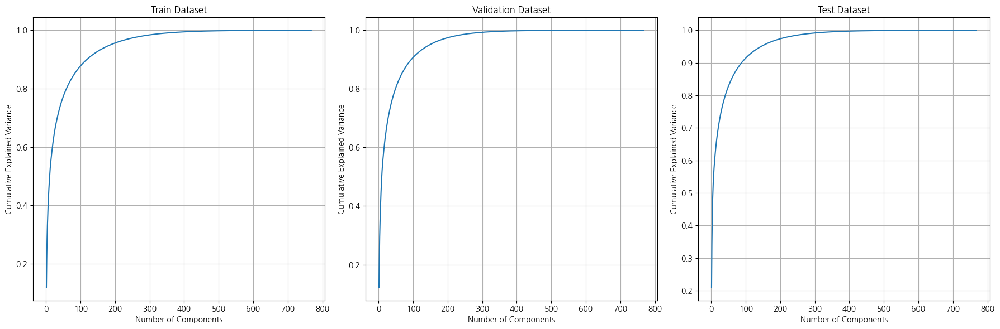

 

이때, Train의 95% 분산 변동비율을 기준으로 `n_components = 186` 선택

| Dataset      | 99% Variance Components | 95% Variance Components |
|--------------|--------------------------|--------------------------|
| Train        | 342                      | 186                      |
| Validation   | 271                      | 147                      |
| Test         | 284                      | 144                      |

#### 2. UMAP
- 더 빠르고 전역 구조를 보존하는 데에 장점
- t-SNE보다 명확한 클러스터링 결과 생성

 

Pairwise Distance Preservation PDP를 기준으로 적합한 `n_components` 값 확인
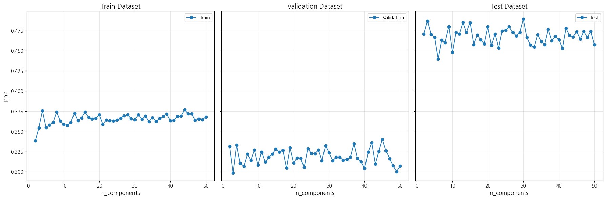

#### 3. t-SNE
t-SNE는 `n_components` 의 값이 3 이상일 때 동작하지 않아, 더 높은 차원을 사용하기 위해 `method='exact'`를 설정할 필요가 있으며 속도는 느려짐
- 로컬 데이터 구조 보존에는 장점을 보임
- 대규모 데이터에서 효율성이 낮고 전체 구조를 보존하기 어려움

#### 4. SVD
#### 5. Kernel PCA
Reconstruction Error을 기준으로 적합한 `n_components` 값 확인
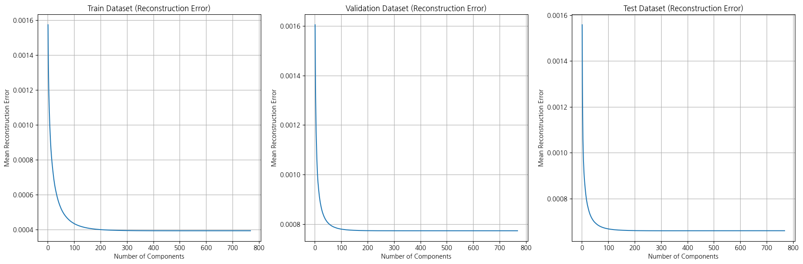

  

이때, Train 기준으로 기울기가 급격히 완화되는 지점인 Elbow point를 도출했고 이는 `n_components = 77`임
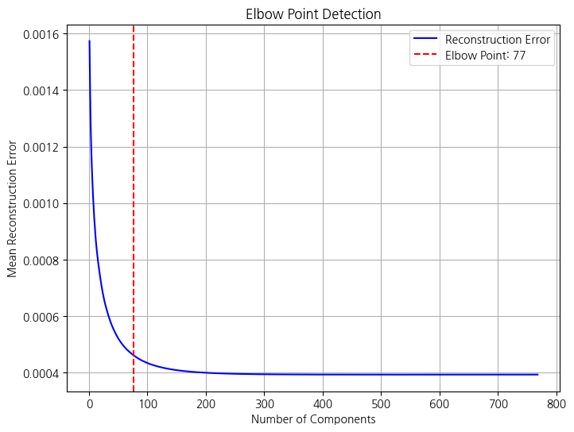

#### 6. GRP Gaussian Random Projection
#### 7. Autoencoders 
#### 8. Ensemble
- PCA + UMAP 
- PCA + t-SNE

### Consine Similarity and Euclidean Distance
|| dim | `train`-`valid`           |  `train`-`test`           |
|--------------------|--------------------|--------------------|--------------------|
|base| 768 |  |  |
|PCA| 186 | 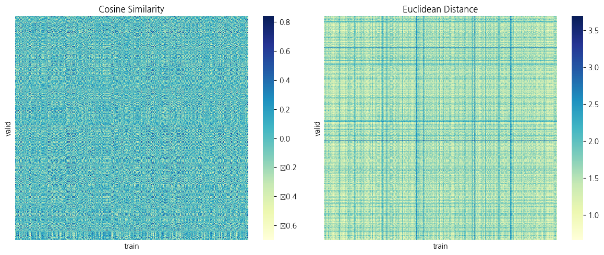 | 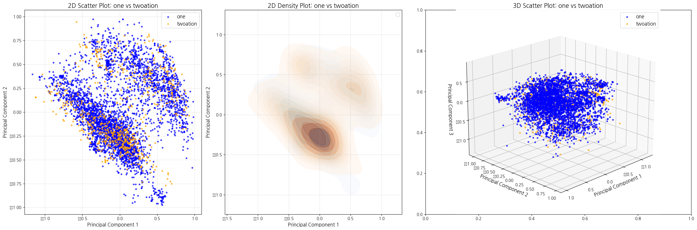 |
|Kernel PCA | 77 | 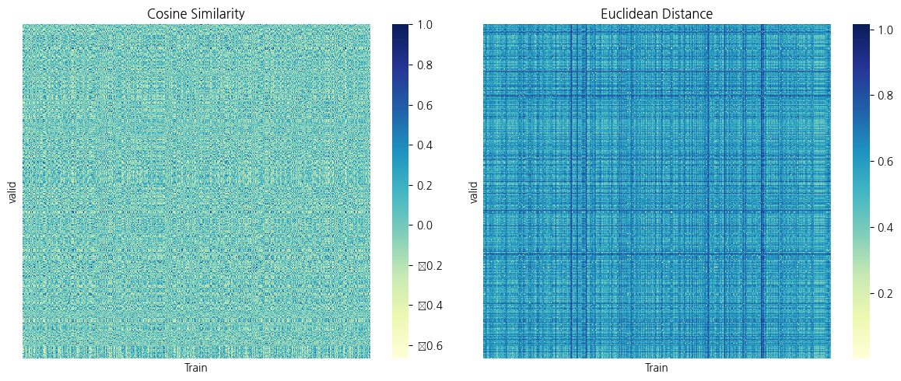 | 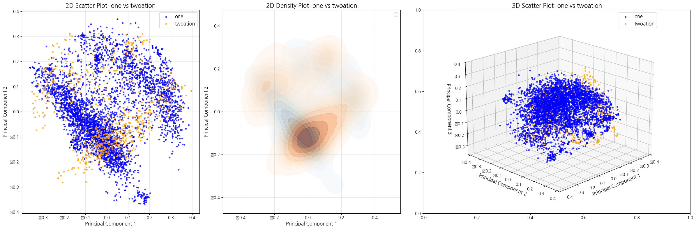 |
|UMAP | 20 | 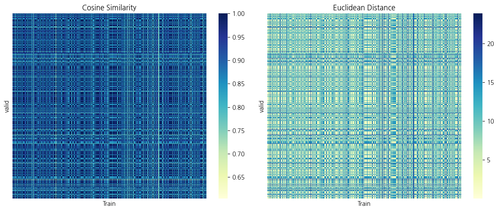 | 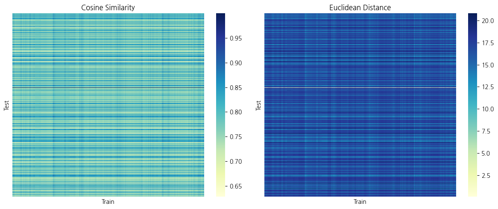 |

### Evaluation 
#### Visualization
 **scatter plot** 와 **dense plot** 를 활용해 시각화를 한 결과는 아래와 같음

||dim| `train`-`valid`           |  `train`-`test`           |
|--------------------|--------------------|--------------------|--------------------|
|PCA| 186 | 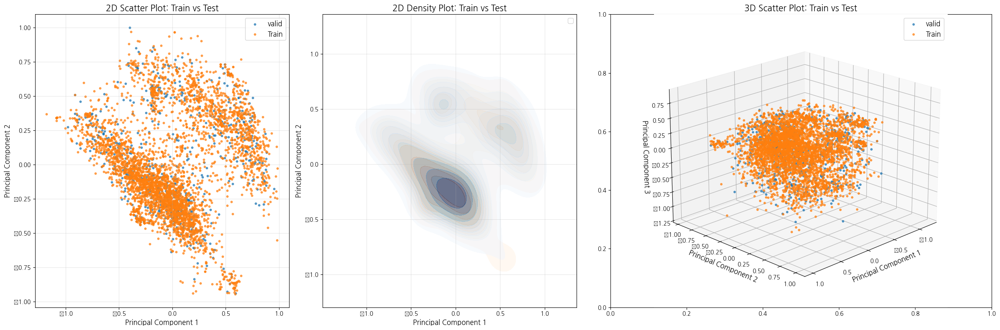 | 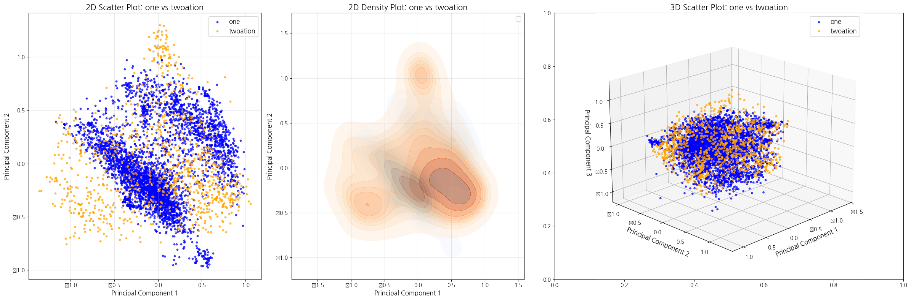 |
|Kernel PCA | 77 | 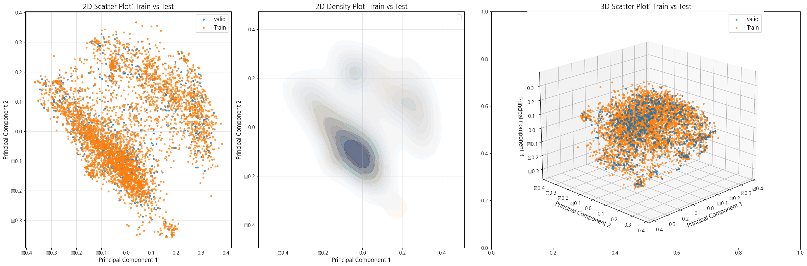 | 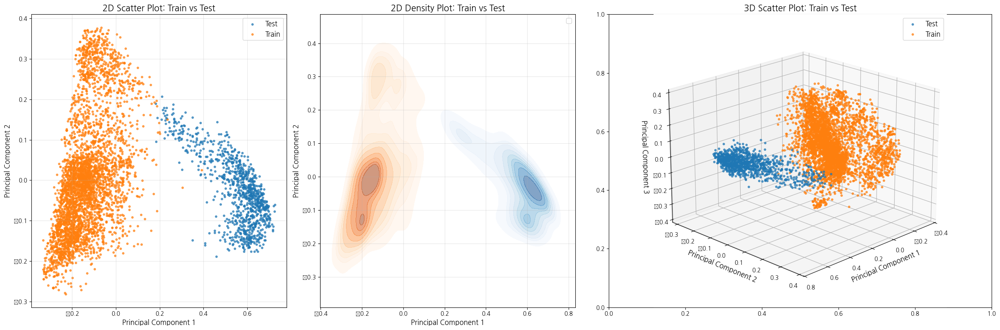 |
|UMAP | 20 | 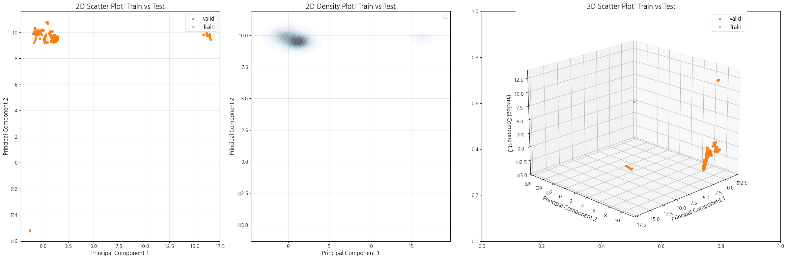 | 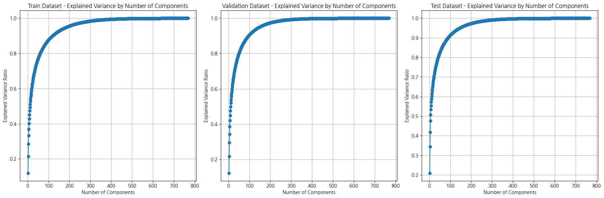 |

#### Metrics
1. **데이터 간 분포 변화 평가**
    - Hellinger Distance
    - Wasserstein Distance
    - Jensen-Shannon Divergence
 

2. **데이터의 구조적 변화 감지**
    - Reconstruction Error
    - Pairwise Distance Preservation
    - Total Variation Distance

        | 기법            | Reconstruction Error       | Pairwise Distance Preservation     | Total Variation Distance          |
        |------------------|----------------------------|------------------------------------|-----------------------------------|
        | **PCA**         | ✅                         | ✅                                 | ❌                                |
        | **Kernel PCA**  | ✅                         | ✅                                 | ❌                                |
        | **UMAP**        | ❌                         | ✅                                 | ✅                                |
        | **t-SNE**       | ❌                         | ✅                                 | ✅                                |
        | **SVD**         | ❌ (간접적으로 가능)       | ✅ (전역 거리 보존)                | ❌                                |
        | **GRP**         | ❌                         | ✅                                 | ✅                                |
        | **Autoencoders**| ✅                         | ❌                                 | ❌                                |

 

3. **통계적 분포 차이 검증**
    - Kolmogorov-Smirnov Test
