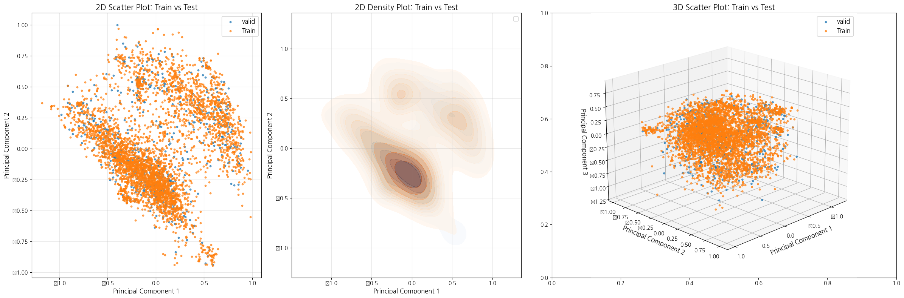

## Experiment Settings

### Methods of Dimension Reduction
1. PCA
2. UMAP
3. t-SNE
4. SVD
5. Kernel PCA
6. GRP Gaussian Random Projection
7. Autoencoders 
8. Ensemble
    - PCA + UMAP 
    - PCA + t-SNE

### New Methods of Dimension Reduction from papers
- [PCA with Hellinger distance](https://link.springer.com/article/10.1007/s10115-020-01438-3)
- [SVD, Kernel PCA, GRP, Autoencoders](https://aclanthology.org/2024.lrec-main.579.pdf)

### Consine Similarity and Euclidean Distance
|| `train`-`valid`           |  `train`-`test`           |
|--------------------|--------------------|--------------------|
|base|  |  |
|pca `n_components=186`|  |  |
|Kernel PCA `n_components=77`|  |  |

### Select dim 
#### 1. PCA 
Explained Variance Ratio 분산 변동 비율을 기준으로 적합한 n_components의 값을 확인

 

이때, Train의 95% 분산 변동비율을 기준으로 `n_components = 186` 선택

| Dataset      | 99% Variance Components | 95% Variance Components |
|--------------|--------------------------|--------------------------|
| Train        | 342                      | 186                      |
| Validation   | 271                      | 147                      |
| Test         | 284                      | 144                      |

#### 2. UMAP
#### 3. t-SNE
#### 4. SVD
#### 5. Kernel PCA
Reconstruction Error을 기준으로 적합한 n_components의 값을 확인

  

이때, Train 기준으로 기울기가 급격히 완화되는 지점인 Elbow point를 도출했고 이는 `n_components = 77`임

#### 6. GRP Gaussian Random Projection
#### 7. Autoencoders 
#### 8. Ensemble
- PCA + UMAP 
- PCA + t-SNE

### Evaluation 
#### Visualization
1. **scatter plot**
2. **dense plot**

|| `train`-`valid`           |  `train`-`test`           |
|--------------------|--------------------|--------------------|
|pca `n_components=186`|  |  |
|Kernel PCA `n_components=77`|  |  |

#### Metrics
1. **데이터 간 분포 변화 평가**
    - Hellinger Distance
    - Wasserstein Distance
    - Jensen-Shannon Divergence
 

2. **데이터의 구조적 변화 감지**
    - Reconstruction Error
    - Pairwise Distance Preservation
    - Total Variation Distance

        | 기법            | Reconstruction Error       | Pairwise Distance Preservation     | Total Variation Distance          |
        |------------------|----------------------------|------------------------------------|-----------------------------------|
        | **PCA**         | ✅                         | ✅                                 | ❌                                |
        | **Kernel PCA**  | ✅                         | ✅                                 | ❌                                |
        | **UMAP**        | ❌                         | ✅                                 | ✅                                |
        | **t-SNE**       | ❌                         | ✅                                 | ✅                                |
        | **SVD**         | ❌ (간접적으로 가능)       | ✅ (전역 거리 보존)                | ❌                                |
        | **GRP**         | ❌                         | ✅                                 | ✅                                |
        | **Autoencoders**| ✅                         | ❌                                 | ❌                                |

 

3. **통계적 분포 차이 검증**
    - Kolmogorov-Smirnov Test
