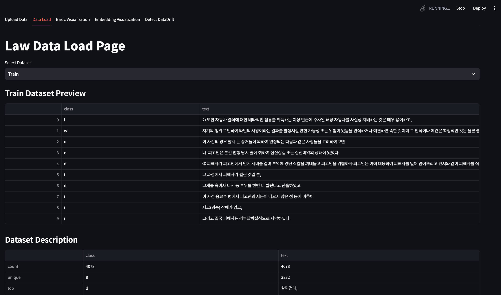
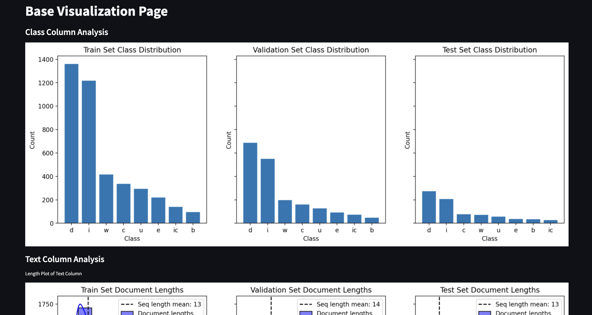
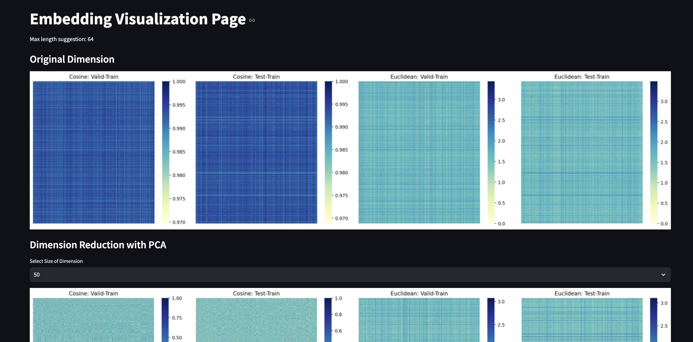
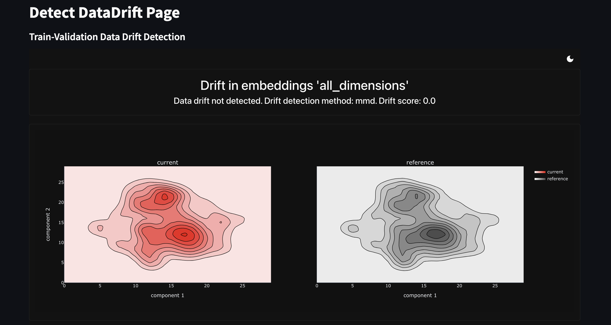

> **✔️ 진행사항 (01.07)**
> 1. csv를 업로드하니까 시각화하는 데까지 너무 오랜 시간이 걸리며, plot_reduced가 작동하지 않음
> 2. docs 업로드(데이터 드리프트, 오픈소스 정리)
> 3. 법률 데이터셋(한림대, LBOX) 모두 streamlit 내에서 잘 작동함

</br>

## Key Features

| [Data Load](pages/data_load.py) | [Base Visualization](pages/base_visualization.py) | [Embedding Visualization](pages/embedding_visualization.py) | [Detect DataDrift](pages/detect_datadrift.py) |
| ---------- | ---------- | ---------- | ---------- |
|     데이터 로드       |     베이스 시각화      |      임베딩 시각화      |    데이터 드리프트 탐지        |
|            |        |            |      |
|  **Dataset**{Preview, Description, Information} | **Class Column Analysis**{Distribution Plot}, </br> **Text Column Analysis**{Length Plot, Length Dataframe, WordCloud}      |     **Original Dimension**{Cosine Similarity, Euclidean Distances}, <br> **Dimension Reduction**{Cosine Similarity, Euclidean Distances, 2D Scatter Plot, 2D Density Plot, 3D Scatter Plot}      | **Evidently AI report**{based MMD}          |
|    ✔️ csv 업로드        |    ✔️ 결측치 공란으로 채워 진행     |  ✔️ 임베딩 세션에 저장한 후 재사용        |             |
|   ☑️ (예정) 데이터셋 이름 입력 받기        |    ☑️ (예정) 형태소 분석기 연결     |  ☑️ (예정) 차원축소 기법 선택 <br/> ☑️ (예정) 차원축소 기법 하이브리드 선택 <br/> ☑️ (예정) 임베딩 시간 오래 걸림        | ☑️ (예정) 탐지 방법 선택           |

## Documentation
데이터 드리프트 탐지와 관련해 아래 문서를 참고
- [Definition of Data Drift](docs/DataDrift.md)
- [Open-Sourece Tools for Detecting Data Drfit](docs/DriftDetection-Tools.md)
- [test type for detecting data drift](docs/)
- [dimesion reduction for effective detecting drift](docs/)


## Usage Instructions
1. streamlit 접속
    
    ```
    streamlit run main.py
    ```

2. ~~데이터셋 업로드~~(추후 수정 예정)
3. 사이드 바를 통해 각 페이지 확인
4. streamlit 중단

    - (window) `ctrl` + `c`
    - (mac) `pkill -f streamlit`

## Install Prerequisite
- library : [requirements](requirements.txt)
- fonts : [나눔고딕 레귤러](https://fonts.google.com/selection)
- datasets : 법률 관련 문서 데이터셋 (한림대학교 연구팀 구축)
- open source : [EvidentlyAI](https://github.com/evidentlyai/evidently/tree/main/examples/integrations/streamlit_dashboard)

## Directory Structure

```
streamlit_dashboard/
├── pages/
│   ├── upload_data.py
│   ├── data_load.py
│   ├── basic_visualization.py
│   ├── embedding_visualization.py
│   ├── detect_datadrift.py
├── main.py
├── utils.py
├── data/
│   ├── train_data.csv
│   ├── val_data.csv
│   ├── test_data.csv
├── fonts/
│   ├── NanumGothic.ttf

```


## Stacks

   