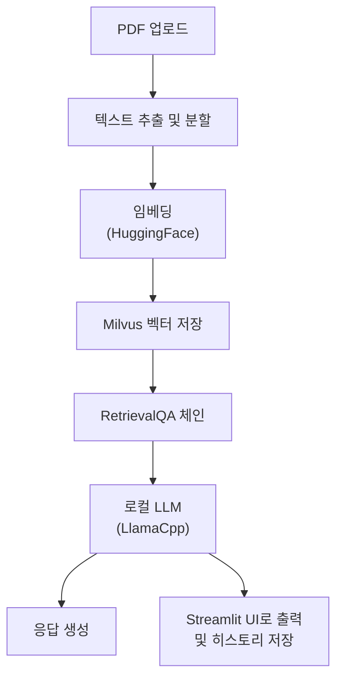

## ✔️ **Overview**

---

### Main point.



* LLM API 미사용 → 비용 없이 로컬에서 추론 가능

### Main tech.

**LangChain**

- 문서 로딩 및 분할
    - 텍스트 추출 : `PyPDFLoader`
    - 청크 단위 분할 : `RecursiveCharacterTextSplitter`
- 임베딩 및 벡터 저장
    - Embedding Model : Hugging Face 임베딩 모델 `sentence-transformers/all-MiniLM-L6-v2`
    - Vector DB : Milvus
    - RAG : `vectorstore.as_retriever()`

**Llama cpp**

로컬에서 실행되는 GGUF 포맷 모델 사용해 `llama-cpp-python`을 통해 LangChain과 연결

- 오픈소스 모델 기반으로 GPU 없이도 로컬 추론 가능
    - 🚀 [ggml-model-Q4_K_M.gguf](https://huggingface.co/heegyu/EEVE-Korean-Instruct-10.8B-v1.0-GGUF/blob/main/ggml-model-Q4_K_M.gguf) ; 로컬에 모델 다운로드 후, 경로 지정 필요
- LLM 추론을 커스터마이징 가능

**Streamlit**

사용자 친화적인 Chatbot 형태 인터페이스로 `streamlit_chat` 으로 대화형 UI 구성

- Full Flow
    1. 파일 업로드 및 자동 처리 (PDF → 텍스트 → 임베딩)
    2. 질문 입력 → 응답 생성 (LangChain QA 체인 활용)
    3. 이전 대화 내용은 `st.session_state`를 통해 히스토리 관리

### **Project Goals.**

- [x]  pdf 업로드 후, 탐색해 원하는 답변을 이끌어낼 수 있는지
- [ ]  (예정) [multiturn chatbot](https://flyduckdev.tistory.com/entry/Rag-OpenAI-RAG-%EA%B8%B0%EB%B0%98-%EC%98%A4%EB%A7%8C%EA%B3%BC-%ED%8E%B8%EA%B2%AC-%EC%B1%97%EB%B4%87-%EA%B5%AC%EC%B6%95%ED%95%98%EA%B8%B0-LangChain-OpenAI-Streamlit) 구현
- [ ]  (예정) option으로 여러 모델 선택할 수 있도록 도입
- [ ]  (예정) RAG 적용 및 구현

## ✔️ Installation

---

1. Clone thie Repository
    
    ```bash
    git clone https://github.com/jeongminia/datadrift_dataclinic.git
    ```
    
2. Navigate to the project directory
    
    ```bash
    # dir : datadrift_dataclinic/temp/pdf_chat/main.py
    cd temp/pdf_chat
    ```
    
3. Install libraries
    
    ```bash
    # (option) virtual environment
    python -m venv chatenv
    source chatenv/bin/activate  # Mac/Linux
    ```
    
    ```bash
    pip install -r requirements.txt
    ```
    
    - llama-cpp-python(cuda)
        - 추가 설치를 진행하지 않으면 model이 cpu에서만 돌아가서 많은 시간이 소요
        - CUDA 옵션을 활성화해서 직접 빌드
        1. 의존 패키지 설치
            
            ```bash
            sudo apt update
            sudo apt install build-essential cmake
            pip install setuptools wheel ninja
            ```
            
        2. install llama-cpp-python 
            
            ```bash
            CMAKE_ARGS="-DLLAMA_CUBLAS=on" FORCE_CMAKE=1 pip install llama-cpp-python --no-binary llama-cpp-python
            ```
            
            - `-DLLAMA_CUBLAS=on` : GPU용 CUDA CUBLAS 백엔드 활성화
            - `FORCE_CMAKE=1` : 항상 새로 빌드
            - `-no-binary` : PyPI wheel 무시하고 소스에서 직접 컴파일

## ✔️ **Usage**

---

1. Streamlit 실행
    
    ```bash
    streamlit run main.py
    ```
    
2. UI 통해서 PDF 업로드
    - Limit 200MB per file • PDF, TXT, DOCX
3. 벡터 DB 구축 완료 시, 사용자가 원하는 질문 챗에 입력
4. Streamlit 중단
    - (mac) `pkill -f streamlit`

## ✔️ References

---

https://wikidocs.net/231360

https://flyduckdev.tistory.com/entry/RAG-%EA%B8%B0%EB%B0%98-Chat-PDF-%EC%B1%97%EB%B4%87-%EB%A7%8C%EB%93%A4%EA%B8%B0-LangChain-Cohere-OpenAI-API%EB%A1%9C-%EB%82%98%EB%A7%8C%EC%9D%98-%EB%AC%B8%EC%84%9C-%EC%A7%88%EB%AC%B8-%EC%8B%9C%EC%8A%A4%ED%85%9C-%EB%A7%8C%EB%93%A4%EA%B8%B0