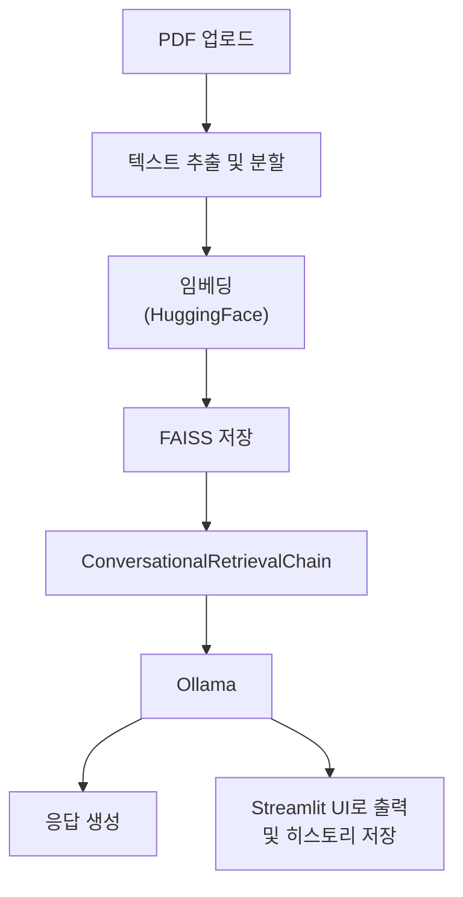

## 👀 **Overview**

### Main point.



* LLM API 미사용 → 비용 없이 로컬에서 추론 가능

### Main tech.

**🦜⛓️ LangChain**

- 문서 로딩 및 분할
    - 텍스트 추출 : `PyPDFLoader`
    - 청크 단위 분할 : `RecursiveCharacterTextSplitter`
- 임베딩 및 벡터 저장
    - Embedding Model : Hugging Face 임베딩 모델 `sentence-transformers/all-MiniLM-L6-v2`
    - Vector DB : FAISS
    - RAG : `vectorstore.as_retriever()`

🐑 **Ollama**

로컬에서 실행되는 `Ollama`을 통해 LangChain과 연결

- 🚀 Yi 34B-Chat

**Streamlit**

사용자 친화적인 Chatbot 형태 인터페이스로 `streamlit_chat` 으로 대화형 UI 구성

### **Project Goals.**

- [x]  pdf 업로드 후, 탐색해 원하는 답변을 이끌어낼 수 있는지
- [x]  [multiturn chatbot](https://flyduckdev.tistory.com/entry/Rag-OpenAI-RAG-%EA%B8%B0%EB%B0%98-%EC%98%A4%EB%A7%8C%EA%B3%BC-%ED%8E%B8%EA%B2%AC-%EC%B1%97%EB%B4%87-%EA%B5%AC%EC%B6%95%ED%95%98%EA%B8%B0-LangChain-OpenAI-Streamlit) 구현
- [x]  Ollama + FAISS
- [x]  답변 형식 고도화
- [ ]  (진행 중) 모델 재선택 (시간단축)
- [ ]  (진행 중) option으로 여러 모델 선택할 수 있도록 도입
- [ ]  (예정) [LangGraph](https://data-newbie.tistory.com/997)


## ✔️ Installation

1. Clone thie Repository
    
    ```bash
    git clone https://github.com/jeongminia/datadrift_dataclinic.git
    ```
    
2. Navigate to the project directory
    
    ```bash
    # dir : datadrift_dataclinic/temp/pdf_chat/main.py
    cd temp/pdf_chat
    ```
    
3. Install libraries
    
    ```bash
    # (option) virtual environment
    python -m venv chatenv
    source chatenv/bin/activate  # Mac/Linux
    ```
    
    ```bash
    pip install -r requirements.txt
    ```
    
    - Install Ollama
        1. Ubuntu에서 Ollama 설치
            
            ```bash
            curl -fsSL https://ollama.com/install.sh | sh
            ```
            
        2. (GPU) 설치
            1. NVIDIA GPU 드라이버 설치
                
                ```bash
                nvidia-smi  # 드라이버가 설치되어 있어야 함
                ```
                
            2. CUDA Toolkit 설치
                
                ```bash
                sudo apt install -y nvidia-cuda-toolkit
                ```
                
            3. nvidia-container-toolkit 설치
                
                ```bash
                distribution=$(. /etc/os-release;echo $ID$VERSION_ID)
                curl -s -L https://nvidia.github.io/libnvidia-container/gpgkey | sudo apt-key add -
                curl -s -L https://nvidia.github.io/libnvidia-container/$distribution/libnvidia-container.list | sudo tee /etc/apt/sources.list.d/nvidia-container-toolkit.list
                sudo apt update
                sudo apt install -y nvidia-container-toolkit
                ```
                
            4. Docker 데몬에 설정 적용
                
                ```bash
                sudo systemctl restart docker
                ```
                
            5. Ollama GPU 실행 (자동으로 감지)
                
                ```bash
                ollama run llama3  # 실행 시 GPU 자동 사용
                ```
                
                실행 중 GPU 사용 확인은:
                
                ```bash
                nvidia-smi
                ```
                
        3. initial settings
            1. Ollama 서비스 시작
                
                ```bash
                sudo systemctl start ollama
                ```
                
            2. 서비스 상태 확인
                
                ```bash
                systemctl status ollama # active (running) 상태여야 함
                ```
                
            3. 서버가 실행 중인지 확인
                
                ```bash
                ollama list
                ```
                
            4. 모델이 없다면 pull로 설치
                
                ```bash
                ollama pull [--모델명--]
                ```
                

## ✔️ **Usage**

1. Streamlit 실행
    
    ```bash
    streamlit run main.py
    ```
    
2. UI 통해서 PDF 업로드
    - Limit 1024MB per file • PDF, TXT, DOCX
3. 벡터 DB 구축 완료 시, 사용자가 원하는 질문 챗에 입력
4. Streamlit 중단
    - (mac) `pkill -f streamlit`

---
## ✔️ References

https://wikidocs.net/231360

https://flyduckdev.tistory.com/entry/RAG-%EA%B8%B0%EB%B0%98-Chat-PDF-%EC%B1%97%EB%B4%87-%EB%A7%8C%EB%93%A4%EA%B8%B0-LangChain-Cohere-OpenAI-API%EB%A1%9C-%EB%82%98%EB%A7%8C%EC%9D%98-%EB%AC%B8%EC%84%9C-%EC%A7%88%EB%AC%B8-%EC%8B%9C%EC%8A%A4%ED%85%9C-%EB%A7%8C%EB%93%A4%EA%B8%B0